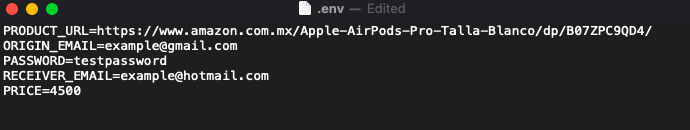
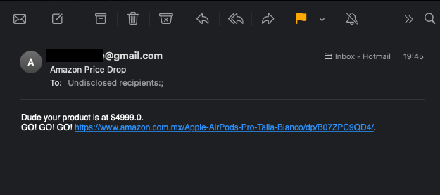

# Amazon Price Tracker

Python Script to track price of a product on Amazon México website and notify when it drops from desired price via email.

### Prerequisites

- Python 3.9+
- [Poetry 1.0.0+](https://python-poetry.org/docs/#installation)
- A Gmail account
- Email to recieve the notification.
### Note
- It is recommended to run this script on [pyhtonanywhere](https://www.pythonanywhere.com/).
- Or if you are an advanced user you could run it as a cron job on your computer
#### Installing
- It is recommended to create a new [gmail account](https://accounts.google.com/signup).
- Make sure 2-Step Verification is off.
- Turn on ['Allow less secure apps'](https://myaccount.google.com/lesssecureapps). 
- Follow the variables in the .env.sample to a .env indicating your own email credentials.
- Open a terminal and navigate to project directory.
- Run poetry install.
- Run poetry shell.
- Run the command: 
    - python tracker.py
- Check inbox for notification.

## Preview
#### 
#### 
